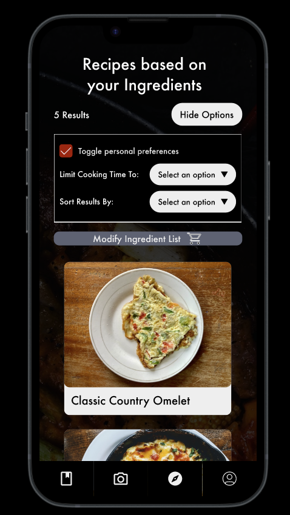

## Smart Fridge Recipe App

**Technologies**: Figma, Usability Testing, Heuristic Evaluation, Survey, UI/UX Design

### Description
- Developed a prototype app that suggests recipes based on a photo of the user's fridge contents.
- Conducted usability testing and heuristic evaluation, using Figma for wireframes and prototyping based on feedback.

### Links
- [PDF Documentation](https://github.com/jchoi471/smart_fridge_recipe_app/blob/main/Project%20Milestone%205_%20Final%20Prototype%20and%20Process%20Book.pdf)
- [Prototype](https://www.figma.com/design/1hSQQ4EZDNblboSE2V945Y/Main-Prototypes?node-id=0-1&t=JAqwFVkf9rYHsOQb-0)
- [Interactive Prototype](https://www.figma.com/proto/1hSQQ4EZDNblboSE2V945Y/Main-Prototypes?node-id=17-109&t=JAqwFVkf9rYHsOQb-0&scaling=scale-down&content-scaling=fixed&page-id=0%3A1&starting-point-node-id=1%3A4)

Prototype Image

Interactive prototype images

  
  
  
  

  
  
  
  

